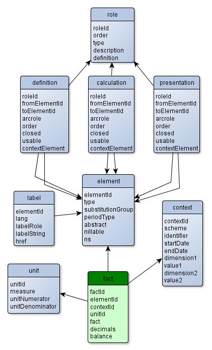

#What is XBRL?
Extensible Business Reporting Language ([XBRL](https://www.xbrl.org/the-standard/what/)) is the open international standard for [digital business reporting](http://xbrl.squarespace.com), managed by a global not for profit consortium, [XBRL International](http://xbrl.org). 


#XBRL parser for R
Parsing XBRL is [not](https://www.xbrl.org/the-standard/how/getting-started-for-developers/) something you could do with your eyes closed.
Fortunately the [XBRL](http://cran.r-project.org/web/packages/XBRL) package by Roberto Bertolusso and Marek Kimel takes all the pain away.

To parse complete XBRL, use `xbrlDoAll` function. 
It extracts xbrl instance and related schema files to a list of data frames.

```{r parse, message=FALSE}
library(XBRL)

inst <- "http://edgar.sec.gov/Archives/edgar/data/21344/000002134414000008/ko-20131231.xml"
options(stringsAsFactors = FALSE)
xbrl.vars <- xbrlDoAll(inst, cache.dir = "XBRLcache", prefix.out = NULL)

str(xbrl.vars, max.level = 1)
```

# Reading XBRL data frames
The data structure of the data frames is shown in the image below 



A simple approach to explore the data in interrelated tables is by using [dplyr](http://cran.r-project.org/web/packages/dplyr) package. 
For example, to extract revenue from the sale of goods we have to join *facts* (the numbers) with the 
*contexts* (periods, dimensions):


```{r sales, message=FALSE}
library(dplyr)

xbrl_sales <-
  xbrl.vars$element %>%
  filter(elementId == "us-gaap_SalesRevenueGoodsNet") %>%
  left_join(xbrl.vars$fact, by = "elementId" ) %>%
  left_join(xbrl.vars$context, by = "contextId") %>%
  filter(is.na(dimension1)) %>%
  select(startDate, endDate, amount = fact, currency = unitId, balance)

knitr::kable(xbrl_sales, format = "markdown")

```

# Presentation: balance sheets example
## Find the statement
XBRL encapsulates several reports. To get the summary count roles by type:

```{r roleid, message=FALSE}
library(dplyr)

xbrl.vars$role %>%
  group_by(type) %>%
  summarize(count=n()) 

```

To find all statements, filter roles by type:
```{r all_statements, message=FALSE}
xbrl.vars$role %>%
  filter(type == "Statement") %>%
  select(roleId, definition) 
```

If interested in a specific statement, search by definition:

```{r statement, message=FALSE}
xbrl.vars$role %>%
  filter(type == "Statement", definition == "1003000 - Statement - CONSOLIDATED BALANCE SHEETS") %>%
  select(roleId) 
```


## Presentation hierarchy
To find out which concepts are reported on specific financial statement component, we have to search the presentation tree from the top element.

```{r balance_sheet, message=FALSE}

library(tidyr)
library(dplyr)

# let's get the balace sheet
role_id <- "http://www.thecocacolacompany.com/role/ConsolidatedBalanceSheets"

# prepare presentation linkbase : 
# filter by role_id an convert order to numeric
pres <- 
  xbrl.vars$presentation %>%
  filter(roleId %in% role_id) %>%
  mutate(order = as.numeric(order))

# start with top element of the presentation tree
pres_df <- 
  pres %>%
  anti_join(pres, by = c("fromElementId" = "toElementId")) %>%
  select(elementId = fromElementId)

# breadth-first search
while({
  df1 <- pres_df %>%
    na.omit() %>%
    left_join( pres, by = c("elementId" = "fromElementId")) %>%
    arrange(elementId, order) %>%
    select(elementId, child = toElementId);
  nrow(df1) > 0
}) 
{
  # add each new level to data frame
  pres_df <- pres_df %>% left_join(df1, by = "elementId")
  names(pres_df) <-  c(sprintf("level%d", 1:(ncol(pres_df)-1)), "elementId")
}
# add last level as special column (the hierarchy may not be uniformly deep)
pres_df["elementId"] <- 
  apply( t(pres_df), 2, function(x){tail( x[!is.na(x)], 1)})
pres_df["elOrder"] <- 1:nrow(pres_df) 

# the final data frame structure is
str(pres_df, vec.len = 1 )


```

## Adding numbers and contexts
Elements (or _concepts_ in XBRL terminology) of the balance sheet are now gathered in data frame with presentation hierarchy levels. To see the numbers we have to join the elements with facts and contexts as in the first example.

```{r results='asis'}
# join concepts with context, facts
pres_df_num <-
  pres_df %>%
  left_join(xbrl.vars$fact, by = "elementId") %>%
  left_join(xbrl.vars$context, by = "contextId") %>%
  filter(is.na(dimension1)) %>%
  filter(!is.na(endDate)) %>%
  select(elOrder, contains("level"), elementId, fact, decimals, endDate) %>%
  mutate( fact = as.numeric(fact) * 10^as.numeric(decimals)) %>%
  spread(endDate, fact ) %>%
  arrange(elOrder)


library(pander)

pres_df_num %>% 
  select(elementId, contains("2013"), contains("2012")) %>%
  pandoc.table(
    style = "rmarkdown",
    split.table = 200,
    justify = c("left", "right", "right"))

```

## Labels

Every concept in XBRL may have several labels (short name, description, documentation, etc.) perhaps in several languages. In presentation linkbase there is a hint (`preferredLabel`) which label should be used preferrably.
Additionally we emphasize the numbers that are computed. We use the relations from calculation linkbase. 

```{r results='asis'}
# labels for our financial statement (role_id) in "en-US" language:
x_labels <-
  xbrl.vars$presentation %>%
  filter(roleId == role_id) %>%
  select(elementId = toElementId, labelRole = preferredLabel) %>%
  semi_join(pres_df_num, by = "elementId") %>%
  left_join(xbrl.vars$label, by = c("elementId", "labelRole")) %>%
  filter(lang == "en-US") %>%
  select(elementId, labelString)

# calculated elements in this statement component
x_calc <- xbrl.vars$calculation %>%
  filter(roleId == role_id) %>%
  select(elementId = fromElementId, calcRoleId = arcrole) %>%
  unique()

# join concepts and numbers with labels
balance_sheet_pretty <- pres_df_num %>%
  left_join(x_labels, by = "elementId") %>%
  left_join(x_calc, by = "elementId") %>%
  select(labelString, contains("2013"), contains("2012"), calcRoleId)


names(balance_sheet_pretty)[1] <- 
  "CONDENSED CONSOLIDATED BALANCE SHEETS (mio USD $)"

# rendering balance sheet
library(pander)
pandoc.table(
  balance_sheet_pretty[,1:3],
  style = "rmarkdown",
  justify = c("left", "right", "right"),
  split.table = 200,
  emphasize.strong.rows = which(!is.na(balance_sheet_pretty$calcRoleId)))


```
