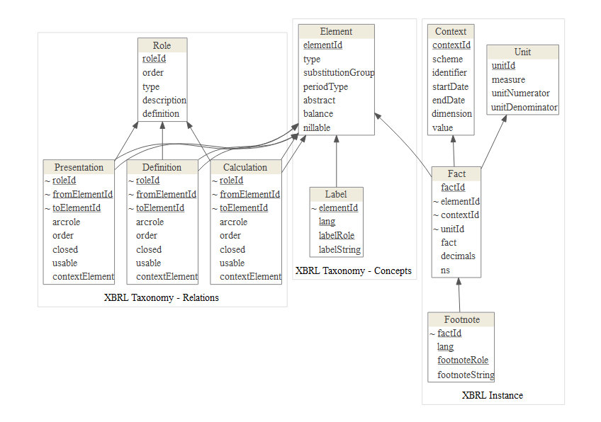

# Exploring XBRL files with R
Darko Bergant  
Saturday, January 17, 2015  

#What is XBRL?
Extensible Business Reporting Language ([XBRL](https://www.xbrl.org/the-standard/what/)) is the open international standard for [digital business reporting](http://xbrl.squarespace.com), managed by a global not for profit consortium, [XBRL International](http://xbrl.org). 


#XBRL Parser for R
Parsing XBRL is [not](https://www.xbrl.org/the-standard/how/getting-started-for-developers/) something you could do with your eyes closed.
Fortunately the [XBRL](http://cran.r-project.org/web/packages/XBRL) package by Roberto Bertolusso and Marek Kimel takes all the pain away.

To parse complete XBRL, use `xbrlDoAll` function. 
It extracts xbrl instance and related schema files to a list of data frames.


```r
library(XBRL)

inst <- "http://edgar.sec.gov/Archives/edgar/data/21344/000002134414000008/ko-20131231.xml"
options(stringsAsFactors = FALSE)
xbrl.vars <- xbrlDoAll(inst, cache.dir = "XBRLcache", prefix.out = NULL)

str(xbrl.vars, max.level = 1)
```

```
## List of 10
##  $ element     :'data.frame':	21453 obs. of  8 variables:
##  $ role        :'data.frame':	96 obs. of  5 variables:
##  $ calculation :'data.frame':	196 obs. of  11 variables:
##  $ context     :'data.frame':	740 obs. of  13 variables:
##  $ unit        :'data.frame':	4 obs. of  4 variables:
##  $ fact        :'data.frame':	2745 obs. of  9 variables:
##  $ footnote    :'data.frame':	6 obs. of  5 variables:
##  $ definition  :'data.frame':	1398 obs. of  11 variables:
##  $ label       :'data.frame':	2798 obs. of  5 variables:
##  $ presentation:'data.frame':	1582 obs. of  11 variables:
```

# XBRL Data Frames Structure
The data structure of the data frames is shown in the image below 



All values are kept in the `fact` table (in the `fact` field, precisely).
The `element` table defines _what_ are these values (the XBRL _concepts_, e.g. “assets”, “liabilities”, “net income” etc.).
The `context` table defines the periods and other dimensions for which the values are reported.

With [dplyr](http://cran.r-project.org/web/packages/dplyr)'s `join` and `filter` it is quite easy to explore the data in interrelated tables. 
For example, to extract revenue from the sale of goods we have to join *facts* (the numbers) with the 
*contexts* (periods, dimensions):


```r
library(dplyr)

xbrl.vars$fact %>%
  filter(elementId == "us-gaap_SalesRevenueGoodsNet") %>%
  left_join(xbrl.vars$context, by = "contextId") %>%
  filter(is.na(dimension1)) %>%
  select(startDate, endDate, fact, decimals, unitId, elementId) %>% 
  (knitr::kable)(format = "markdown")
```


|startDate  |endDate    |fact        |decimals |unitId |elementId                    |
|:----------|:----------|:-----------|:--------|:------|:----------------------------|
|2011-01-01 |2011-12-31 |46542000000 |-6       |usd    |us-gaap_SalesRevenueGoodsNet |
|2012-01-01 |2012-12-31 |48017000000 |-6       |usd    |us-gaap_SalesRevenueGoodsNet |
|2013-01-01 |2013-12-31 |46854000000 |-6       |usd    |us-gaap_SalesRevenueGoodsNet |

# Balance Sheet Example
## Select Statement
XBRL encapsulates several reports of different types:


```r
table(xbrl.vars$role$type)
```

```
## 
## Disclosure   Document  Statement 
##         86          1          9
```

To find all _statements_, filter roles by `type`:

```r
htmlTable::htmlTable(data.frame(Statements=
  with(
    xbrl.vars$role[xbrl.vars$role$type=="Statement", ],
    paste(roleId, "\n<br/>", definition, "\n<p/>")
  )),
  align = "l",
  rnames = FALSE
)
```

<table class='gmisc_table' style='border-collapse: collapse;' >
<thead>
<tr>
<th style='border-bottom: 1px solid grey; border-top: 2px solid grey; text-align: center;'>Statements</th>
</tr>
</thead>
<tbody>
<tr>
<td style='text-align: left;'>http://www.thecocacolacompany.com/role/ConsolidatedBalanceSheetParentheticals 
<br/> 1003500 - Statement - CONSOLIDATED BALANCE SHEET (Parentheticals) 
<p/></td>
</tr>
<tr>
<td style='text-align: left;'>http://www.thecocacolacompany.com/role/ConsolidatedBalanceSheets 
<br/> 1003000 - Statement - CONSOLIDATED BALANCE SHEETS 
<p/></td>
</tr>
<tr>
<td style='text-align: left;'>http://www.thecocacolacompany.com/role/ConsolidatedStatementsOfCashFlows 
<br/> 1004000 - Statement - CONSOLIDATED STATEMENTS OF CASH FLOWS 
<p/></td>
</tr>
<tr>
<td style='text-align: left;'>http://www.thecocacolacompany.com/role/ConsolidatedStatementsOfComprehensiveIncome 
<br/> 1002000 - Statement - CONSOLIDATED STATEMENTS OF COMPREHENSIVE INCOME 
<p/></td>
</tr>
<tr>
<td style='text-align: left;'>http://www.thecocacolacompany.com/role/ConsolidatedStatementsOfComprehensiveIncomeCalc2 
<br/> 1002000 - Statement - CONSOLIDATED STATEMENTS OF COMPREHENSIVE INCOME 
<p/></td>
</tr>
<tr>
<td style='text-align: left;'>http://www.thecocacolacompany.com/role/ConsolidatedStatementsOfIncome 
<br/> 1001000 - Statement - CONSOLIDATED STATEMENTS OF INCOME 
<p/></td>
</tr>
<tr>
<td style='text-align: left;'>http://www.thecocacolacompany.com/role/ConsolidatedStatementsOfIncomeCalc2 
<br/> 1001000 - Statement - CONSOLIDATED STATEMENTS OF INCOME 
<p/></td>
</tr>
<tr>
<td style='text-align: left;'>http://www.thecocacolacompany.com/role/ConsolidatedStatementsOfShareownersEquity 
<br/> 1005000 - Statement - CONSOLIDATED STATEMENTS OF SHAREOWNERS' EQUITY 
<p/></td>
</tr>
<tr>
<td style='border-bottom: 2px solid grey; text-align: left;'>http://www.thecocacolacompany.com/role/ConsolidatedStatementsOfShareownersEquityParentheticals 
<br/> 1005500 - Statement - CONSOLIDATED STATEMENTS OF SHAREOWNERS' EQUITY (Parentheticals) 
<p/></td>
</tr>
</tbody>
</table>


## Presentation hierarchy
To find out which concepts are reported on specific financial statement component, we have to search the presentation tree from the top element.


```r
library(tidyr)
library(dplyr)

# let's get the balace sheet
role_id <- "http://www.thecocacolacompany.com/role/ConsolidatedBalanceSheets"

# prepare presentation linkbase : 
# filter by role_id an convert order to numeric
pres <- 
  xbrl.vars$presentation %>%
  filter(roleId %in% role_id) %>%
  mutate(order = as.numeric(order))

# start with top element of the presentation tree
pres_df <- 
  pres %>%
  anti_join(pres, by = c("fromElementId" = "toElementId")) %>%
  select(elementId = fromElementId)

# breadth-first search
while({
  df1 <- pres_df %>%
    na.omit() %>%
    left_join( pres, by = c("elementId" = "fromElementId")) %>%
    arrange(elementId, order) %>%
    select(elementId, child = toElementId);
  nrow(df1) > 0
}) 
{
  # add each new level to data frame
  pres_df <- pres_df %>% left_join(df1, by = "elementId")
  names(pres_df) <-  c(sprintf("level%d", 1:(ncol(pres_df)-1)), "elementId")
}
# add last level as special column (the hierarchy may not be uniformly deep)
pres_df["elementId"] <- 
  apply( t(pres_df), 2, function(x){tail( x[!is.na(x)], 1)})
pres_df["elOrder"] <- 1:nrow(pres_df) 

# the final data frame structure is
str(pres_df, vec.len = 1 )
```

```
## 'data.frame':	37 obs. of  8 variables:
##  $ level1   : chr  "us-gaap_StatementOfFinancialPositionAbstract" ...
##  $ level2   : chr  "us-gaap_StatementTable" ...
##  $ level3   : chr  "us-gaap_StatementScenarioAxis" ...
##  $ level4   : chr  "us-gaap_ScenarioUnspecifiedDomain" ...
##  $ level5   : chr  NA ...
##  $ level6   : chr  NA ...
##  $ elementId: chr  "us-gaap_ScenarioUnspecifiedDomain" ...
##  $ elOrder  : int  1 2 ...
```

## Amounts and Contexts
Elements (or _concepts_ in XBRL terminology) of the balance sheet are now gathered in data frame with presentation hierarchy levels. To see the numbers we have to join the elements with numbers from `fact` table and periods from `context` table:


```r
# join concepts with context, facts
pres_df_num <-
  pres_df %>%
  left_join(xbrl.vars$fact, by = "elementId") %>%
  left_join(xbrl.vars$context, by = "contextId") %>%
  filter(is.na(dimension1)) %>%
  filter(!is.na(endDate)) %>%
  select(elOrder, contains("level"), elementId, fact, decimals, endDate) %>%
  mutate( fact = as.numeric(fact) * 10^as.numeric(decimals)) %>%
  spread(endDate, fact ) %>%
  arrange(elOrder)

library(pander)
pres_df_num %>% 
  select(elementId, contains("2013"), contains("2012")) %>%
  pandoc.table(
    style = "rmarkdown",
    split.table = 200,
    justify = c("left", "right", "right")
  )
```


| elementId                                                                      |   2013-12-31 |   2012-12-31 |
|:-------------------------------------------------------------------------------|-------------:|-------------:|
| us-gaap_CashAndCashEquivalentsAtCarryingValue                                  |        10414 |         8442 |
| us-gaap_OtherShortTermInvestments                                              |         6707 |         5017 |
| us-gaap_CashCashEquivalentsAndShortTermInvestments                             |        17121 |        13459 |
| us-gaap_MarketableSecuritiesCurrent                                            |         3147 |         3092 |
| us-gaap_AccountsReceivableNetCurrent                                           |         4873 |         4759 |
| us-gaap_InventoryNet                                                           |         3277 |         3264 |
| us-gaap_PrepaidExpenseAndOtherAssetsCurrent                                    |         2886 |         2781 |
| us-gaap_AssetsHeldForSaleCurrent                                               |            0 |         2973 |
| us-gaap_AssetsCurrent                                                          |        31304 |        30328 |
| us-gaap_EquityMethodInvestments                                                |        10393 |         9216 |
| ko_AvailableForSaleSecuritiesAndCostMethodInvestments                          |         1119 |         1232 |
| us-gaap_OtherAssetsNoncurrent                                                  |         4661 |         3585 |
| us-gaap_PropertyPlantAndEquipmentNet                                           |        14967 |        14476 |
| us-gaap_IndefiniteLivedTrademarks                                              |         6744 |         6527 |
| us-gaap_IndefiniteLivedFranchiseRights                                         |         7415 |         7405 |
| us-gaap_Goodwill                                                               |        12312 |        12255 |
| ko_OtherIndefiniteLivedAndFiniteLivedIntangibleAssets                          |         1140 |         1150 |
| us-gaap_Assets                                                                 |        90055 |        86174 |
| us-gaap_AccountsPayableAndAccruedLiabilitiesCurrent                            |         9577 |         8680 |
| ko_LoansAndNotesPayable                                                        |        16901 |        16297 |
| us-gaap_LongTermDebtCurrent                                                    |         1024 |         1577 |
| us-gaap_AccruedIncomeTaxesCurrent                                              |          309 |          471 |
| ko_LiabilitiesHeldForSaleAtCarryingValue                                       |            0 |          796 |
| us-gaap_LiabilitiesCurrent                                                     |        27811 |        27821 |
| us-gaap_LongTermDebtNoncurrent                                                 |        19154 |        14736 |
| us-gaap_OtherLiabilitiesNoncurrent                                             |         3498 |         5468 |
| us-gaap_DeferredTaxLiabilitiesNoncurrent                                       |         6152 |         4981 |
| us-gaap_CommonStockValue                                                       |         1760 |         1760 |
| us-gaap_AdditionalPaidInCapitalCommonStock                                     |        12276 |        11379 |
| us-gaap_RetainedEarningsAccumulatedDeficit                                     |        61660 |        58045 |
| us-gaap_AccumulatedOtherComprehensiveIncomeLossNetOfTax                        |        -3432 |        -3385 |
| us-gaap_TreasuryStockValue                                                     |        39091 |        35009 |
| us-gaap_StockholdersEquity                                                     |        33173 |        32790 |
| us-gaap_MinorityInterest                                                       |          267 |          378 |
| us-gaap_StockholdersEquityIncludingPortionAttributableToNoncontrollingInterest |        33440 |        33168 |
| us-gaap_LiabilitiesAndStockholdersEquity                                       |        90055 |        86174 |

## Labels

Every concept in XBRL may have several labels (short name, description, documentation, etc.) perhaps in several languages. In presentation linkbase there is a hint (`preferredLabel`) which label should be used preferrably. Additionally the computed rows are emphasized. 


```r
# labels for our financial statement (role_id) in "en-US" language:
x_labels <-
  xbrl.vars$presentation %>%
  filter(roleId == role_id) %>%
  select(elementId = toElementId, labelRole = preferredLabel) %>%
  semi_join(pres_df_num, by = "elementId") %>%
  left_join(xbrl.vars$label, by = c("elementId", "labelRole")) %>%
  filter(lang == "en-US") %>%
  select(elementId, labelString)

# calculated elements in this statement component
x_calc <- xbrl.vars$calculation %>%
  filter(roleId == role_id) %>%
  select(elementId = fromElementId, calcRoleId = arcrole) %>%
  unique()

# join concepts and numbers with labels
balance_sheet_pretty <- pres_df_num %>%
  left_join(x_labels, by = "elementId") %>%
  left_join(x_calc, by = "elementId") %>%
  select(labelString, contains("2013"), contains("2012"), calcRoleId)


names(balance_sheet_pretty)[1] <- 
  "CONDENSED CONSOLIDATED BALANCE SHEETS (mio USD $)"

names(balance_sheet_pretty)[2:3] <-
 format(as.Date(names(balance_sheet_pretty)[2:3]), "%Y")
# rendering balance sheet

pandoc.table(
  balance_sheet_pretty[,1:3],
  style = "rmarkdown",
  justify = c("left", "right", "right"),
  split.table = 300,
  big.mark = ",",
  emphasize.strong.rows = which(!is.na(balance_sheet_pretty$calcRoleId))
)
```


| CONDENSED CONSOLIDATED BALANCE SHEETS (mio USD $)                                                            |       2013 |       2012 |
|:-------------------------------------------------------------------------------------------------------------|-----------:|-----------:|
| Cash and cash equivalents                                                                                    |     10,414 |      8,442 |
| Short-term investments                                                                                       |      6,707 |      5,017 |
| **TOTAL CASH, CASH EQUIVALENTS AND SHORT-TERM INVESTMENTS**                                                  | **17,121** | **13,459** |
| Marketable securities                                                                                        |      3,147 |      3,092 |
| Trade accounts receivable, less allowances of $61 and $53, respectively                                      |      4,873 |      4,759 |
| Inventories                                                                                                  |      3,277 |      3,264 |
| Prepaid expenses and other assets                                                                            |      2,886 |      2,781 |
| Assets held for sale                                                                                         |          0 |      2,973 |
| **TOTAL CURRENT ASSETS**                                                                                     | **31,304** | **30,328** |
| EQUITY METHOD INVESTMENTS                                                                                    |     10,393 |      9,216 |
| OTHER INVESTMENTS, PRINCIPALLY BOTTLING COMPANIES                                                            |      1,119 |      1,232 |
| OTHER ASSETS                                                                                                 |      4,661 |      3,585 |
| PROPERTY, PLANT AND EQUIPMENT - net                                                                          |     14,967 |     14,476 |
| TRADEMARKS WITH INDEFINITE LIVES                                                                             |      6,744 |      6,527 |
| BOTTLERS' FRANCHISE RIGHTS WITH INDEFINITE LIVES                                                             |      7,415 |      7,405 |
| GOODWILL                                                                                                     |     12,312 |     12,255 |
| OTHER INTANGIBLE ASSETS                                                                                      |      1,140 |      1,150 |
| **TOTAL ASSETS**                                                                                             | **90,055** | **86,174** |
| Accounts payable and accrued expenses                                                                        |      9,577 |      8,680 |
| Loans and notes payable                                                                                      |     16,901 |     16,297 |
| Current maturities of long-term debt                                                                         |      1,024 |      1,577 |
| Accrued income taxes                                                                                         |        309 |        471 |
| Liabilities held for sale                                                                                    |          0 |        796 |
| **TOTAL CURRENT LIABILITIES**                                                                                | **27,811** | **27,821** |
| LONG-TERM DEBT                                                                                               |     19,154 |     14,736 |
| OTHER LIABILITIES                                                                                            |      3,498 |      5,468 |
| DEFERRED INCOME TAXES                                                                                        |      6,152 |      4,981 |
| Common stock, $0.25 par value; Authorized — 11,200 shares; Issued — 7,040 and 7,040 shares, respectively |      1,760 |      1,760 |
| Capital surplus                                                                                              |     12,276 |     11,379 |
| Reinvested earnings                                                                                          |     61,660 |     58,045 |
| Accumulated other comprehensive income (loss)                                                                |     -3,432 |     -3,385 |
| Treasury stock, at cost — 2,638 and 2,571 shares, respectively                                             |     39,091 |     35,009 |
| **EQUITY ATTRIBUTABLE TO SHAREOWNERS OF THE COCA-COLA COMPANY**                                              | **33,173** | **32,790** |
| EQUITY ATTRIBUTABLE TO NONCONTROLLING INTERESTS                                                              |        267 |        378 |
| **TOTAL EQUITY**                                                                                             | **33,440** | **33,168** |
| **TOTAL LIABILITIES AND EQUITY**                                                                             | **90,055** | **86,174** |

## Calculation Hierarchy
XBRL includes three hierarchies of concepts: definition, presentation and
calculation. Hierarchies are stored as links in `definition`,
`presentation` and `calculation` tables. Columns `fromElementId` and 
`toElementId` represent parent and child. 

Sometimes it is easier to use calculation hierarchy 
when it is reshaped into elements table with
explicit hierarchy position:


```r
role_id <- "http://www.thecocacolacompany.com/role/ConsolidatedBalanceSheets"

relations <- 
  xbrl.vars$calculation %>% 
  filter(roleId == role_id) %>% 
  select(fromElementId, toElementId, order)

elements <-
  data.frame( 
    elementId = with(relations, unique(c(fromElementId, toElementId))),
    stringsAsFactors = FALSE
  )  %>%
  left_join(xbrl.vars$element, by = c("elementId")) %>%
  left_join(relations, by = c("elementId" = "toElementId")) %>%
  left_join(xbrl.vars$label, by = c("elementId")) %>%
  filter(labelRole == "http://www.xbrl.org/2003/role/label") %>% 
  transmute(elementId, parentId = fromElementId, order, balance, labelString)

# get top element(s) in hierarchy  
level <- 1
df1 <- elements %>%
  filter(is.na(parentId)) %>%
  mutate(id = "") %>% 
  arrange(desc(balance))

# search the tree
while({
  level_str <- 
    unname(unlist(lapply(split(df1$id, df1$id), function(x) {
      sprintf("%s%02d", x, 1:length(x))
    })))
  
  elements[elements$elementId %in% df1$elementId, "level"] <- level
  to_update <- elements[elements$elementId %in% df1$elementId, "elementId"]
  elements[ 
    #order(match(elements$elementId, to_update))[1:length(level_str)], 
    order(match(elements$elementId, df1$elementId))[1:length(level_str)], 
    "id"] <- level_str
  
  df1 <- elements %>%
    filter(parentId %in% df1$elementId) %>%
    arrange(order) %>%
    select(elementId, parentId) %>%
    left_join(elements, by=c("parentId"="elementId")) %>%
    arrange(id)
  nrow(df1) > 0})
{
  level <- level + 1
}

# order by hierarchy ID and mark terminal nodes 
elements <- 
  elements %>%  
  dplyr::arrange_(~id) %>% 
  dplyr::mutate( 
    terminal = !elementId %in% parentId,
    Element = paste(
      substring(paste(rep("&nbsp;",10), collapse = ""), 1, (level-1)*2*6),
      gsub("us-gaap_", "",elementId)
    )
  )

pandoc.table(
  elements[, c("Element", "balance", "level", "id")],
  style = "rmarkdown",
  justify = c("left", "left", "left", "left"),
  split.table = 300,
  emphasize.strong.rows = which(elements$level == 1)
)
```


| Element                                                                              | balance    | level   | id       |
|:-------------------------------------------------------------------------------------|:-----------|:--------|:---------|
| **Assets**                                                                           | **debit**  | **1**   | **01**   |
| &nbsp;&nbsp; AssetsCurrent                                                           | debit      | 2       | 0101     |
| &nbsp;&nbsp;&nbsp;&nbsp; CashCashEquivalentsAndShortTermInvestments                  | debit      | 3       | 010101   |
| &nbsp;&nbsp;&nbsp;&nbsp;&nbsp;&nbsp; CashAndCashEquivalentsAtCarryingValue           | debit      | 4       | 01010101 |
| &nbsp;&nbsp;&nbsp;&nbsp;&nbsp;&nbsp; OtherShortTermInvestments                       | debit      | 4       | 01010102 |
| &nbsp;&nbsp;&nbsp;&nbsp; MarketableSecuritiesCurrent                                 | debit      | 3       | 010102   |
| &nbsp;&nbsp;&nbsp;&nbsp; AccountsReceivableNetCurrent                                | debit      | 3       | 010103   |
| &nbsp;&nbsp;&nbsp;&nbsp; InventoryNet                                                | debit      | 3       | 010104   |
| &nbsp;&nbsp;&nbsp;&nbsp; PrepaidExpenseAndOtherAssetsCurrent                         | debit      | 3       | 010105   |
| &nbsp;&nbsp;&nbsp;&nbsp; AssetsHeldForSaleCurrent                                    | debit      | 3       | 010106   |
| &nbsp;&nbsp; EquityMethodInvestments                                                 | debit      | 2       | 0102     |
| &nbsp;&nbsp; ko_AvailableForSaleSecuritiesAndCostMethodInvestments                   | debit      | 2       | 0103     |
| &nbsp;&nbsp; OtherAssetsNoncurrent                                                   | debit      | 2       | 0104     |
| &nbsp;&nbsp; PropertyPlantAndEquipmentNet                                            | debit      | 2       | 0105     |
| &nbsp;&nbsp; IndefiniteLivedTrademarks                                               | debit      | 2       | 0106     |
| &nbsp;&nbsp; IndefiniteLivedFranchiseRights                                          | debit      | 2       | 0107     |
| &nbsp;&nbsp; Goodwill                                                                | debit      | 2       | 0108     |
| &nbsp;&nbsp; ko_OtherIndefiniteLivedAndFiniteLivedIntangibleAssets                   | debit      | 2       | 0109     |
| **LiabilitiesAndStockholdersEquity**                                                 | **credit** | **1**   | **02**   |
| &nbsp;&nbsp; LiabilitiesCurrent                                                      | credit     | 2       | 0201     |
| &nbsp;&nbsp;&nbsp;&nbsp; AccountsPayableAndAccruedLiabilitiesCurrent                 | credit     | 3       | 020101   |
| &nbsp;&nbsp;&nbsp;&nbsp; ko_LoansAndNotesPayable                                     | credit     | 3       | 020102   |
| &nbsp;&nbsp;&nbsp;&nbsp; LongTermDebtCurrent                                         | credit     | 3       | 020103   |
| &nbsp;&nbsp;&nbsp;&nbsp; AccruedIncomeTaxesCurrent                                   | credit     | 3       | 020104   |
| &nbsp;&nbsp;&nbsp;&nbsp; ko_LiabilitiesHeldForSaleAtCarryingValue                    | credit     | 3       | 020105   |
| &nbsp;&nbsp; LongTermDebtNoncurrent                                                  | credit     | 2       | 0202     |
| &nbsp;&nbsp; OtherLiabilitiesNoncurrent                                              | credit     | 2       | 0203     |
| &nbsp;&nbsp; DeferredTaxLiabilitiesNoncurrent                                        | credit     | 2       | 0204     |
| &nbsp;&nbsp; StockholdersEquityIncludingPortionAttributableToNoncontrollingInterest  | credit     | 2       | 0205     |
| &nbsp;&nbsp;&nbsp;&nbsp; StockholdersEquity                                          | credit     | 3       | 020501   |
| &nbsp;&nbsp;&nbsp;&nbsp;&nbsp;&nbsp; CommonStockValue                                | credit     | 4       | 02050101 |
| &nbsp;&nbsp;&nbsp;&nbsp;&nbsp;&nbsp; AdditionalPaidInCapitalCommonStock              | credit     | 4       | 02050102 |
| &nbsp;&nbsp;&nbsp;&nbsp;&nbsp;&nbsp; RetainedEarningsAccumulatedDeficit              | credit     | 4       | 02050103 |
| &nbsp;&nbsp;&nbsp;&nbsp;&nbsp;&nbsp; AccumulatedOtherComprehensiveIncomeLossNetOfTax | credit     | 4       | 02050104 |
| &nbsp;&nbsp;&nbsp;&nbsp;&nbsp;&nbsp; TreasuryStockValue                              | debit      | 4       | 02050105 |
| &nbsp;&nbsp;&nbsp;&nbsp; MinorityInterest                                            | credit     | 3       | 020502   |

_Notice that TreasuryStockValue element has different balance side than its parent
element StockholdersEquity. In this case the element value should be deducted instead
of added to the total sum, when calculating (or validating) the value of its parent
concept._

## Related

### [finstr](https://github.com/bergant/finstr) package: financial statements in R

[finstr](https://github.com/bergant/finstr) package includes the
"data wrangling" functions needed to use the XBRL data 
and allows user to focus on financial statement analysis.

### [xbrlus](https://github.com/bergant/xbrlus) package: R interface to XBRL US API

XBRL US (http://xbrl.us/) provides
free access to their database via 
[XBRL US API](https://github.com/xbrlus/data_analysis_toolkit/).
Package [xbrlus](https://github.com/bergant/xbrlus) is an R interface to this API.
